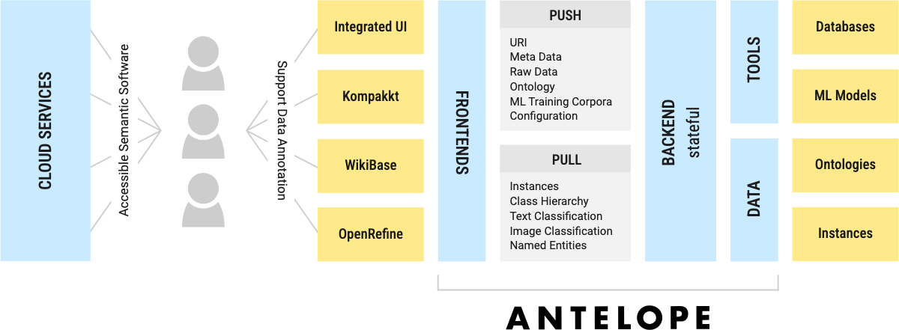
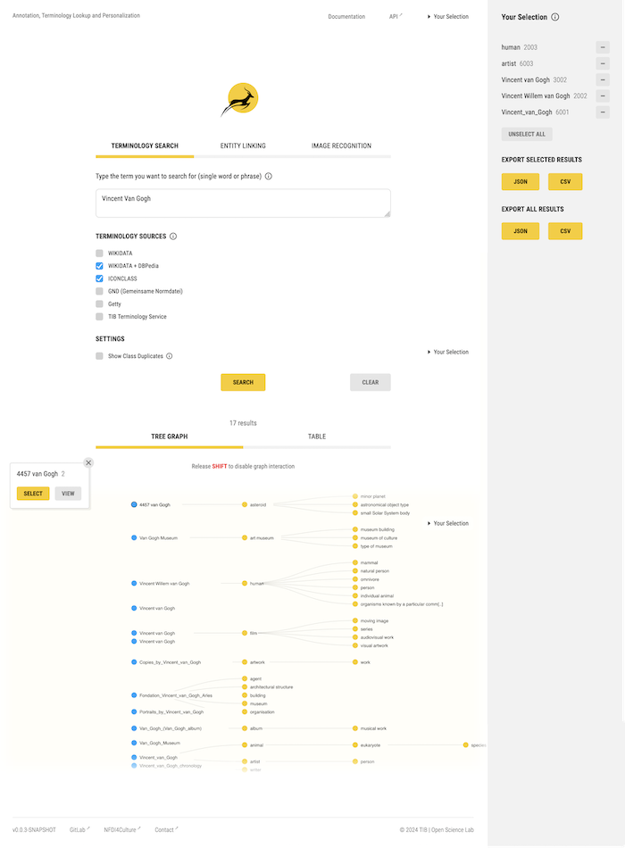

# [ANTELOPE](https://service.tib.eu/annotation/): Annotation, Terminology Lookup and Personalization

 

  

**ANTELOPE** is a free, open-source service to support your data annotation. It offers terminology search, entity linking and easy integration into your projects. The serice integrates with various terminology services and enduser applications (Wikibase and Kompakkt for now). At that, it supports users with process automation and named entity recognition features.

## ⚠️ Project Status

We are in an iterative process of research and development of ANTELOPE.

**Further Reading**:

- [Example user stories / workflows](https://miro.com/app/board/uXjVOn6frZY=/)
- [Report of preparatory workshop with NFDI community](https://zenodo.org/record/7100818)
- [Plug-in solution](https://youtu.be/FvU6O23Ozyc)
- [Integrated NER solutions](https://semlab.io/howto/selavy_alpha)

## Architecture

## Integrated UI

## Resources

- [High level roadmap](https://docs.google.com/spreadsheets/d/1aCI6LHKs70q2vynO-L1MyRJqbS7IpzHY1dtj4lMIkqY/edit?usp=sharing)
- [Current issues](https://gitlab.com/nfdi4culture/ta5-knowledge-graph/annotation-service/-/issues)
- [Milestones](https://gitlab.com/nfdi4culture/ta5-knowledge-graph/annotation-service/-/milestones)

---

 
