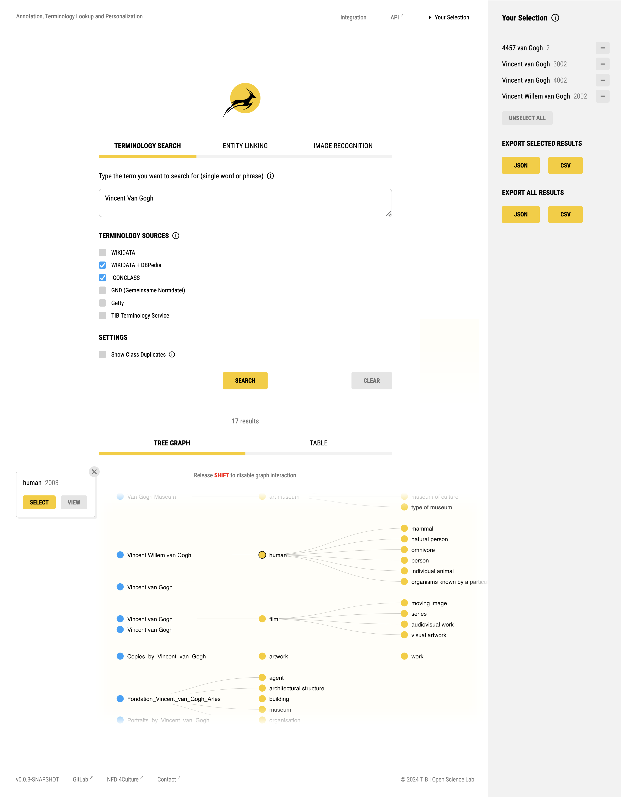

# <ins>ANTELOPE</ins>: <ins>An</ins>notation, <ins>Te</ins>rminology <ins>Lo</ins>okup and <ins>Pe</ins>rsonalization

 

  

**ANTELOPE** is a free, open-source service to support your data annotation. It offers terminology search, entity linking and easy integration into your projects. The serice integrates with various terminology services and enduser applications (Wikibase and Kompakkt for now). At that, it supports users with process automation and named entity recognition features.
  
• [View Application](https://service.tib.eu/annotation)  
• [Documentation](https://nfdi4culture.gitlab.io/ta5-knowledge-graph/antelope-documentation)  
• [Developer README](./readme/)

## Getting Started

ANTELOPE can be used in two ways: The recommended way to get started is through the provided user interface (UI). The [UI](https://service.tib.eu/annotation) has been modelled after identified ergonomic needs and common workflows of researchers. The service is also available as a headless application programming interface (API). The [API](https://service.tib.eu/annotation/api.htm) favors seamless integration into existing systems, as well as bulk data processing.

#### Development

1. Clone repository and `cd` to respective path on disc.
2. Run `npm install` to install dependencies.
3. Run `npm start` to start the application.

## Contributing

This project is open (see [license](./LICENSE)) to the public research community. Active participation through any constructive contributions is expressly welcome. [Learn more](./readme/) on how to develop this service.

## Roadmap

A high level roadmap can be [viewed here](https://docs.google.com/spreadsheets/d/1aCI6LHKs70q2vynO-L1MyRJqbS7IpzHY1dtj4lMIkqY/edit?gid=1007010121#gid=1007010121). For more granular development, follow the issues and the milestones in this repository and the TA5 sub-group.

---

 

  &copy;
  

